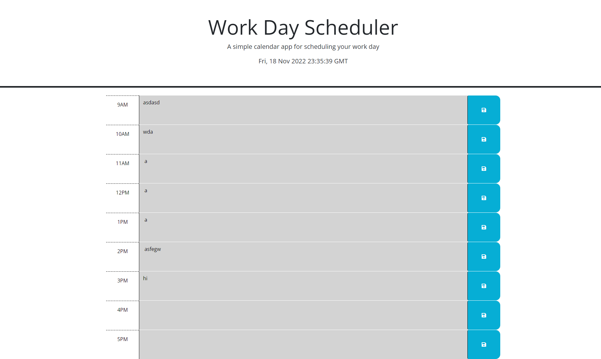

# <Work-Day-Scheduler>

## Description
This website provides the opportunity to set daily reminders for their respective time slots. The application saves your inputs to local storage and applies them to the page upon the press of a button. The site also provides color coordination on whether the reminder is in the present, future, or past.

## Installation

Visit the website via this url: 
Visit the Github repo via this url: 

## Usage

Type in your daily tasks in their respective time slot. If the time slot is green, that means it is in the future. If it is grey, that means it is in the past. If the slot is read, then that task is in the present.

  

## Features

This project features the utilization of local storage. Whatever you type into the text fields with be saved to local storage and applied to the page. 
